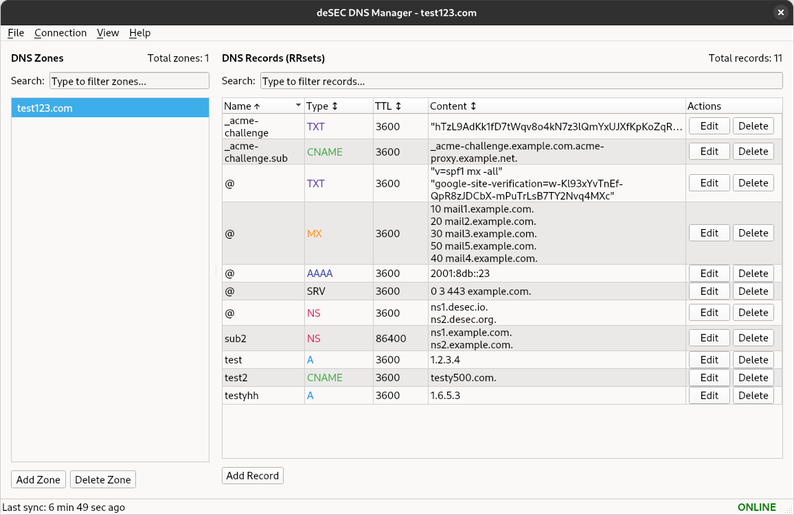
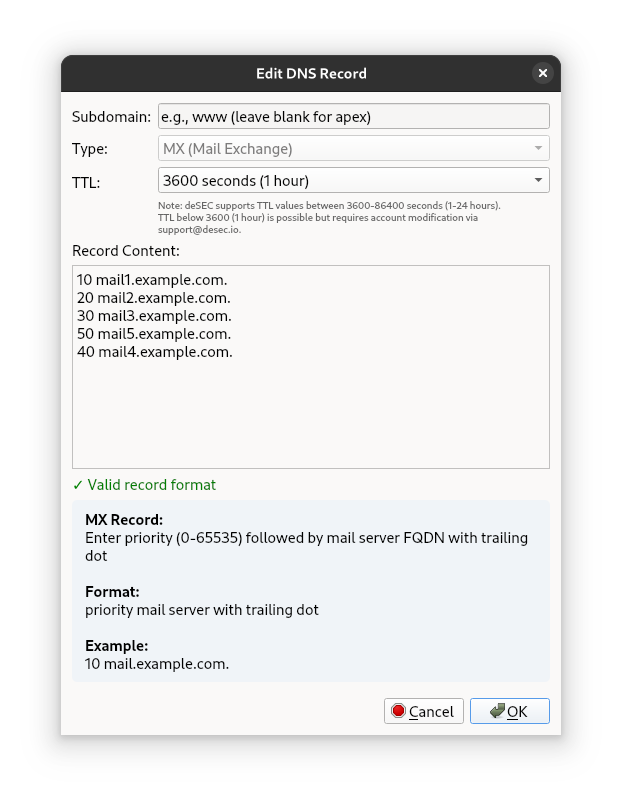

# deSEC Qt6 DNS Manager





A Qt6 desktop application for managing DNS zones and records using the deSEC DNS API.

## Features

- Authentication with deSEC API token
- Zone management (add, delete, list, search)
- DNS record management (view, add, edit, delete)
- Support for the following resource record types: ```A, AAAA, AFSDB, APL, CAA, CDNSKEY, CDS, CERT, CNAME, DHCID, DNAME, DNSKEY, DLV, DS, EUI48, EUI64, HINFO, HTTPS, KX, L32, L64, LOC, LP, MX, NAPTR, NID, NS, OPENPGPKEY, PTR, RP, SMIMEA, SPF, SRV, SSHFP, SVCB, TLSA, TXT, URI```
- Record-specific TTL management
- Data caching for offline access
- Clear Cache functionality to refresh data
- Two-pane layout for easy navigation
- Configuration editor for API settings
- Performance-optimized with indexed lookups
- Full keyboard navigation with shortcuts
- DNS record table sorting by clicking column headers
- Double-click to edit records
- Multiline DNS records display for better readability
- Integrated log console within the main window
- Offline mode with visual indicators
- Elapsed time display since last sync

## Limitations

- TTL values are limited to a range of 3600-86400 seconds (1-24 hours) by the deSEC API
- For values outside this range, contact deSEC directly for account-specific adjustments

## Unsupported

- Automatically managed resource records are not exposed via deSEC API, namingly: ```DNSKEY, DS, CDNSKEY, CDS, NSEC3PARAM, RRSIG```
- Additional resource records of the following types can be added e.g. to add extra public keys for DNSSEC: ```DNSKEY, DS, CDNSKEY```
- See [DNSSEC Caveat](https://desec.io/api/v1/records#dnssec-caveat) for more details.

## Setup

### 1. Create and activate a virtual environment

```bash
# Create a virtual environment
python -m venv venv

# Activate the virtual environment
# On Linux/macOS:
source venv/bin/activate
# On Windows:
# venv\Scripts\activate
```

### 2. Install the Python dependencies

```bash
pip install -r requirements.txt
```

### 3. Run the application

```bash
python src/main.py
```

### 4. Enter your deSEC API token when prompted

When you're done using the application, you can deactivate the virtual environment:

```bash
deactivate
```

Alternatively, just close the terminal.

## Configuration

The application stores configuration in:

```plaintext
~/.config/desecqt/config.json
```

You can edit the API URL and authentication token through the application's configuration editor.

## Documentation

Detailed documentation is available in the `doc/` directory:

- [Architecture](doc/ARCHITECTURE.md) - Details on the application's structure and design patterns
- [Caching System](doc/CACHING.md) - Information about the multi-layered caching implementation with optimized indexing
- [Configuration](doc/CONFIG.md) - Guide to configuration options and settings
- [Logs and Notifications](doc/LOGS-AND-NOTIFICATIONS.md) - Logging and notification system information

## License

This project is open source software licensed under the MIT License.

