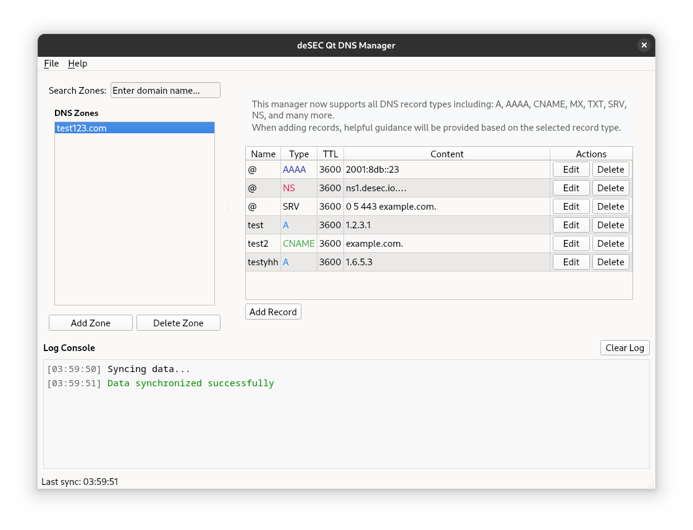

# deSEC Qt6 DNS Manager



A Qt6 desktop application for managing DNS zones and records using the deSEC DNS API.

## Features

- Authentication with deSEC API token
- Zone management (add, delete, list, search)
- DNS record management (view, add, edit, delete)
- Support for A, CNAME, MX, and TXT record types
- Record-specific TTL management
- Data caching for offline access
- Two-pane layout for easy navigation
- Configuration editor for API settings

## Setup

### 1. Create and activate a virtual environment

```bash
# Create a virtual environment
python -m venv venv

# Activate the virtual environment
# On Linux/macOS:
source venv/bin/activate
# On Windows:
# venv\Scripts\activate
```

### 2. Install the Python dependencies

```bash
pip install -r requirements.txt
```

### 3. Run the application

```bash
python src/main.py
```

### 4. Enter your deSEC API token when prompted

When you're done using the application, you can deactivate the virtual environment:

```bash
deactivate
```

## Configuration

The application stores configuration in:

```plaintext
~/.config/desecqt/config.json
```

You can edit the API URL and authentication token through the application's configuration editor.

## License

This project is open source software licensed under the MIT License.