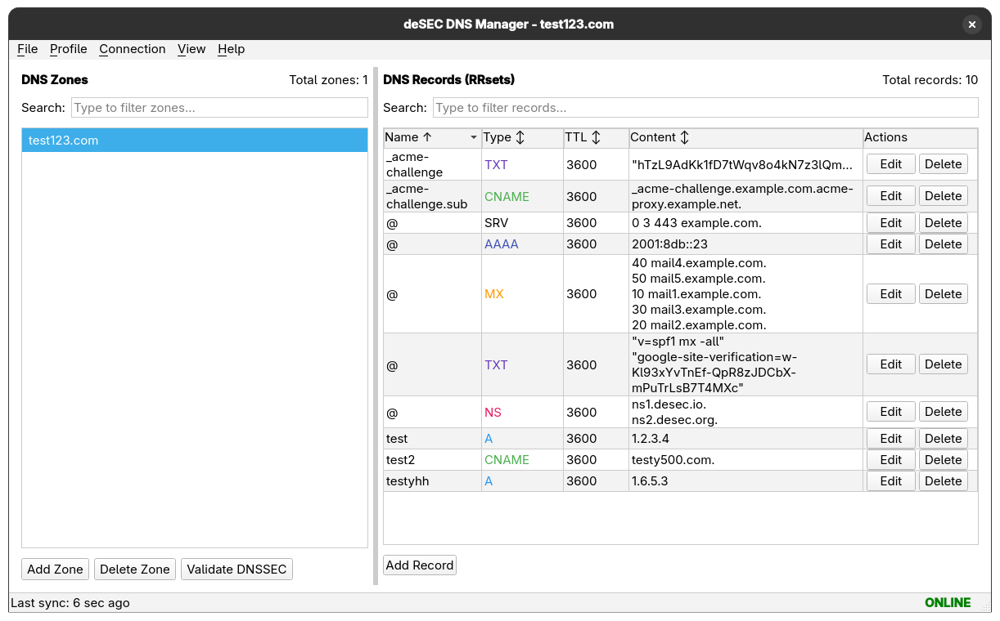
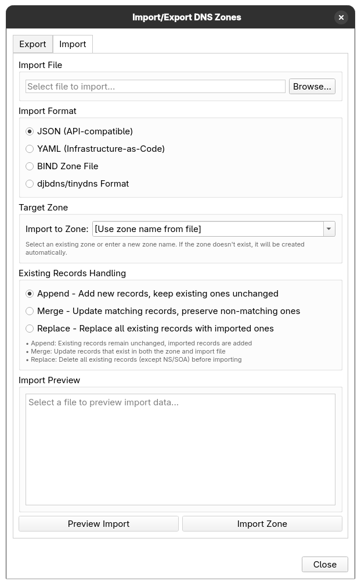
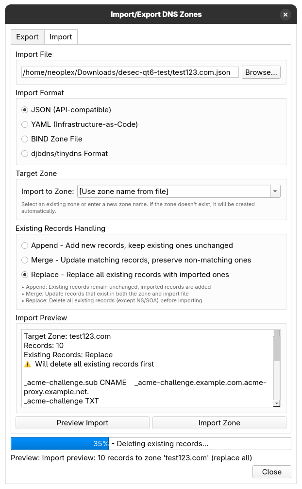
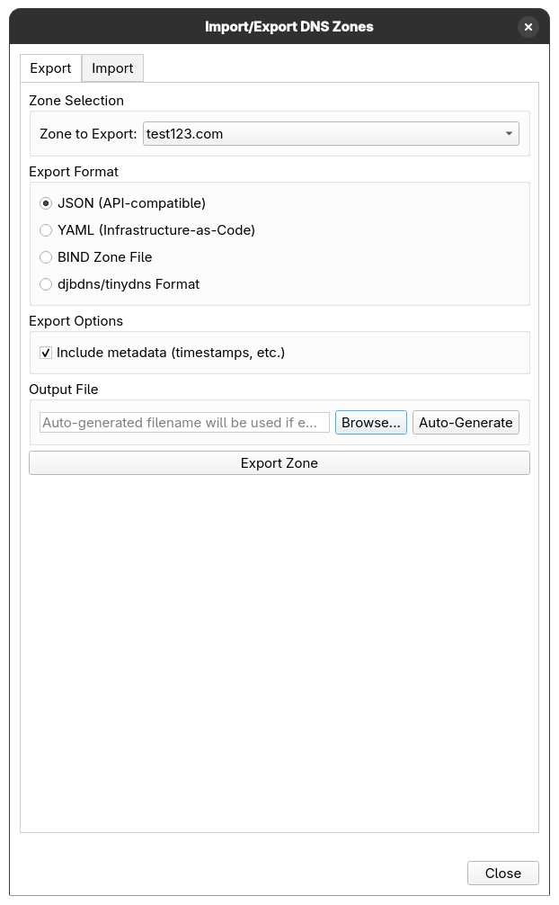
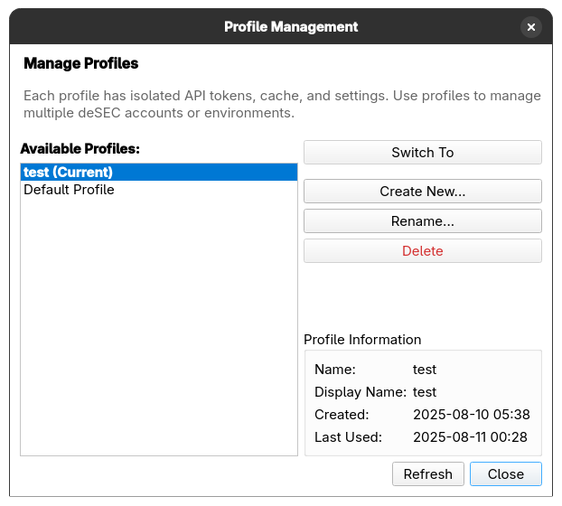
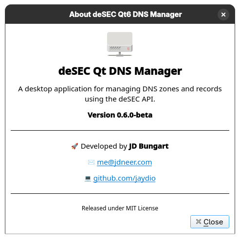

# Screenshots

This directory contains screenshots of the deSEC Qt DNS Manager application showcasing its various features and interfaces.

## Application Screenshots

### Main Interface

**`main_window.png`** (130 KB)
- Primary application interface showing the two-pane layout
- Zone list on the left, DNS records table on the right
- Demonstrates the clean, modern UI with toolbar and status information
- Shows active zone management and record display

### Import/Export Functionality

**`import_window.png`** (85 KB)
- Import dialog showing file selection and format options
- Demonstrates the various import formats supported (JSON, YAML, BIND, djbdns)
- Shows target zone selection and import mode options (Append/Merge/Replace)

**`import_window_wizard_running.png`** (118 KB)
- Import process in progress with real-time progress tracking
- Shows the progress bar, status updates, and rate limiting controls
- Demonstrates the enhanced user feedback during import operations

**`export_window.png`** (50 KB)
- Export dialog with zone selection and format options
- Shows export configuration options and auto-generated filename
- Demonstrates the comprehensive export functionality

### Multi-Profile Support

**`multi_profile_window.png`** (49 KB)
- Profile management interface showing multiple user profiles
- Demonstrates profile creation, switching, and management capabilities
- Shows the isolated environment support for different deSEC accounts

### Configuration

**`settings_window.png`** (56 KB)
- Application settings and configuration interface
- Shows API configuration, theme selection, and other preferences
- Demonstrates the built-in configuration editor

### About Dialog

**`about_window.png`** (38 KB)
- Application about dialog showing version information
- Displays application details, developer information, and version number
- Shows the clean, professional about interface

## Usage in Documentation

These screenshots are referenced in the main README.md and various documentation files to provide visual context for the application's features and capabilities.

### Main README Reference
- `main_window.png` is featured prominently in the main README.md as the primary application showcase

### Feature Documentation
- Import/export screenshots support the comprehensive import/export documentation
- Profile management screenshots illustrate the multi-profile functionality
- Settings screenshots demonstrate the configuration capabilities

## Screenshot Guidelines

When updating or adding new screenshots:

1. **Consistency**: Use the same theme and window size for consistency
2. **Content**: Ensure screenshots show meaningful, representative data
3. **Quality**: Use high-resolution PNG format for clarity
4. **Privacy**: Avoid showing sensitive information like real API tokens
5. **Currency**: Keep screenshots up-to-date with the latest UI changes

## File Sizes

| Screenshot | Size | Purpose |
|------------|------|---------|
| `main_window.png` | 130 KB | Primary interface showcase |
| `import_window_wizard_running.png` | 118 KB | Import progress demonstration |
| `import_window.png` | 85 KB | Import dialog overview |
| `settings_window.png` | 56 KB | Configuration interface |
| `export_window.png` | 50 KB | Export functionality |
| `multi_profile_window.png` | 49 KB | Profile management |
| `about_window.png` | 38 KB | Application information |

**Total**: ~525 KB for complete visual documentation of the application.
