# Screenshots

All screenshots are from the dark theme on Linux. The sidebar is expanded to its full 180 px width unless otherwise noted.

---

## 01 — Main Window

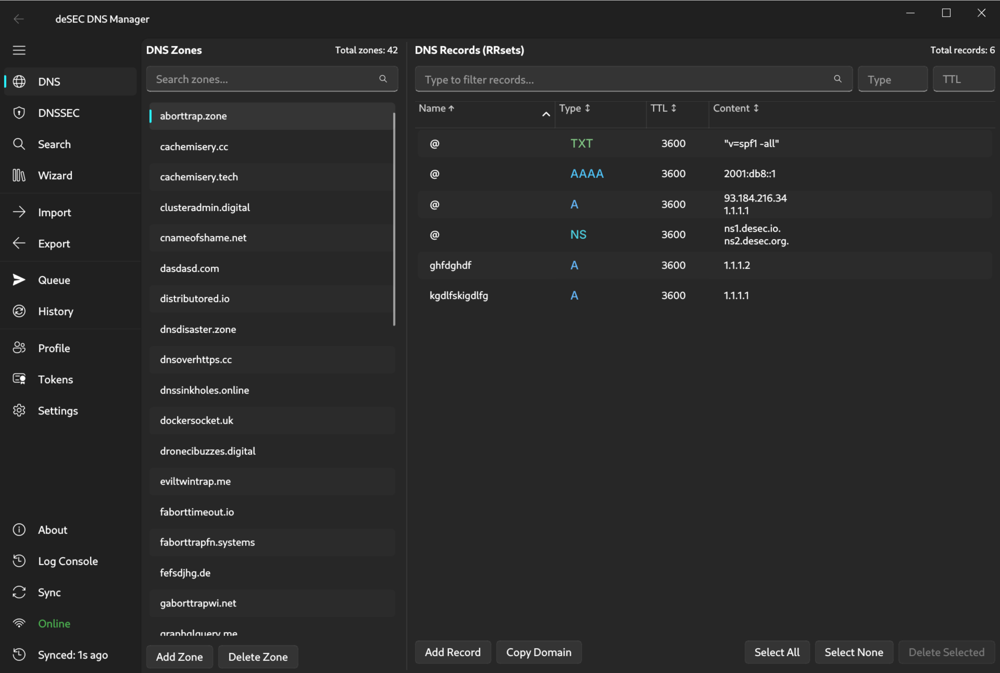

- Two-pane layout: zone list on the left (42/100 account limit), DNS records table on the right
- Zone list sorted alphabetically; active zone `aborttrap.zone` highlighted
- Records table search bar with dedicated **Type** and **TTL** filter fields to the right
- Records show colour-coded type labels (TXT, AAAA, A, NS, CNAME) with TTL and content
- Toolbar: **Add Record**, **Select All**, **Select None**, **Delete Selected**
- Sidebar shows all top-level items: DNS, DNSSEC, Search, Import, Export, Queue, History, Profile, Tokens, Settings
- Bottom bar: About, Log Console, Sync, Online status (green), last sync timestamp

---

## 02 — Add Record Panel

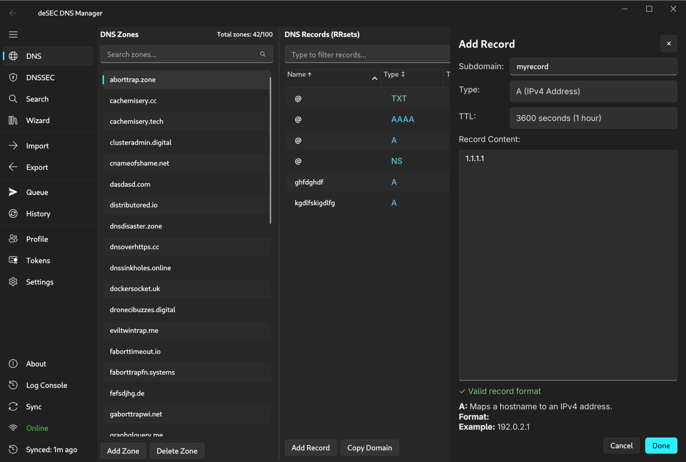

- `RecordEditPanel` slide-in (440 px) overlaying the records table
- Fields: Subdomain (`myrecord`), Type (`A (IPv4 Address)`), TTL (`3600 seconds (1 hour)`), Record Content (`1.1.1.1`)
- Green **"✓ Valid record format"** indicator with format hint and example below the content field
- Cancel / Done buttons at the bottom right

---

## 03 — Error Toast (Duplicate Record)

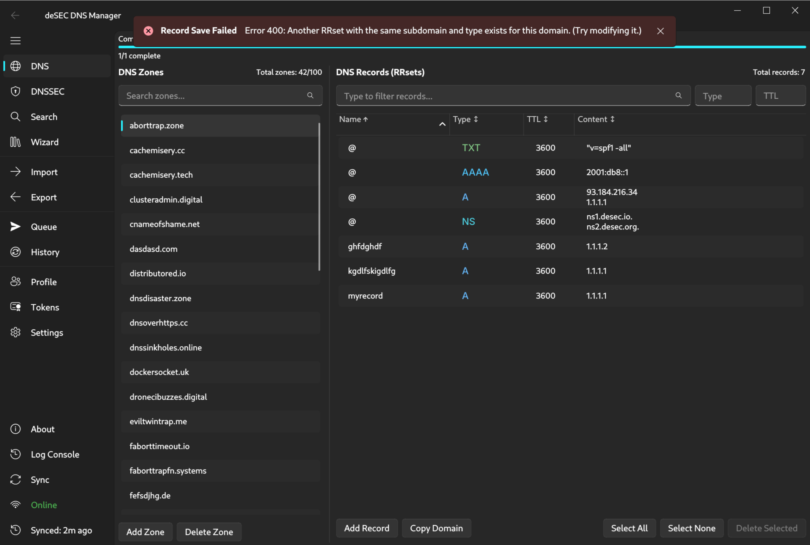

- Red **InfoBar** toast anchored to the top-centre of the window: *"Record Save Failed — Error 400: Another RRset with the same subdomain and type exists for this domain. (Try modifying it.)"*
- Toast auto-dismisses after 8 seconds; no user interaction required
- Underlying DNS page and record table remain fully visible and usable

---

## 04 — DNSSEC Keys

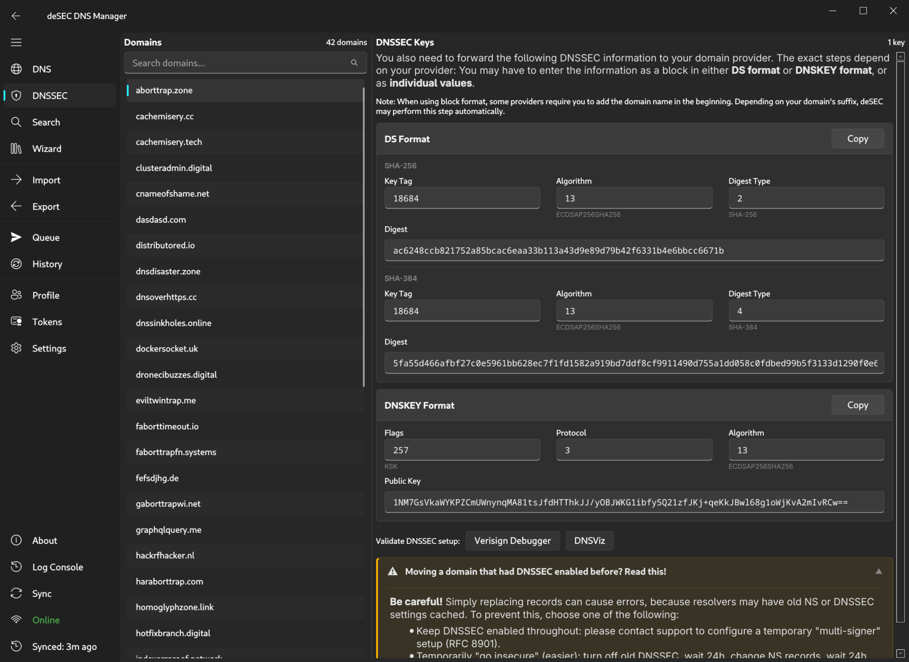

- **DNSSEC** sidebar page with zone selector; `aborttrap.zone` loaded (1 key)
- Introductory text explains DS format vs. DNSKEY format and provider-specific requirements
- **DS Format** card: two digest variants in one card
  - SHA-256 section: Key Tag 18684 · Algorithm 13 (ECDSAP256SHA256) · Digest Type 2
  - SHA-384 section: Key Tag 18684 · Algorithm 13 · Digest Type 4 · full digest hex shown
- **DNSKEY Format** card: Flags 257 (KSK) · Protocol 3 · Algorithm 13 (ECDSAP256SHA256) · Public Key field
- **Copy** button on each card; **Validate DNSSEC setup** links to Verisign Debugger and DNSViz

---

## 05 — Global Search & Replace

- **Search** sidebar page; 4 results across 3 zones after searching content `1.1.1.1`
- Search filters: Subname, Content, Type, TTL, Zone, Use regex toggle
- Results table: Zone, Subname, Type, TTL, Content columns
- Actions panel (right): Replace Content (Find / Replace / Subname / TTL fields), Delete Records, Change Log
- **Select All**, **Select None**, **Export Results…** controls at the bottom

---

## 06 — Import

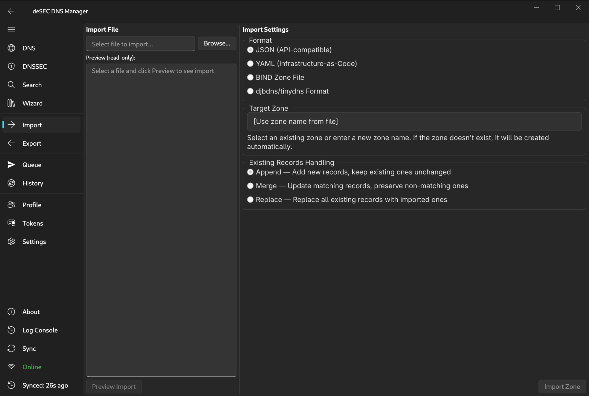

- **Import** sidebar page; left pane: file selector with Browse button and read-only preview area
- Right pane — Import Settings:
  - **Format**: JSON (API-compatible), YAML (Infrastructure-as-Code), BIND Zone File, djbdns/tinydns
  - **Target Zone**: use zone name from file (or select/create)
  - **Existing Records Handling**: Append / Merge / Replace with descriptions
- **Preview Import** and **Import Zone** buttons at the bottom

---

## 07 — Export

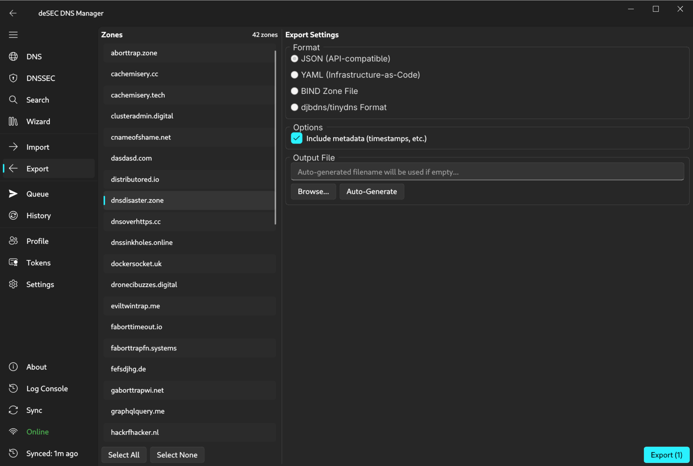

- **Export** sidebar page; left pane: scrollable zone list (42 zones); `dnsdisaster.zone` selected
- Right pane — Export Settings:
  - **Format**: JSON, YAML, BIND Zone File, djbdns/tinydns
  - **Options**: Include metadata (timestamps) checkbox ticked
  - **Output File**: auto-generated filename field with Browse and Auto-Generate buttons
- **Export (1)** primary button at the bottom right; **Select All** / **Select None** below the zone list

---

## 08 — Queue Overview

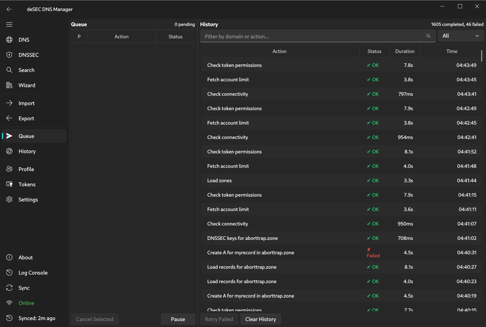

- **Queue** sidebar page; left pane shows 0 pending items
- Right pane — History: 975 completed, 42 failed entries with columns Action, Status, Duration, Time
- Entries include: Check token permissions (OK), Fetch account limit (OK), Check connectivity (OK), DNSSEC keys for aborttrap.zone (OK), Create CNAME for www in aborttrap.zone (**Failed**)
- Filter bar above history; status dropdown (All / OK / Failed)
- Controls: **Cancel Selected**, **Pause**, **Retry Failed**, **Clear History**

---

## 09 — Queue Entry Detail

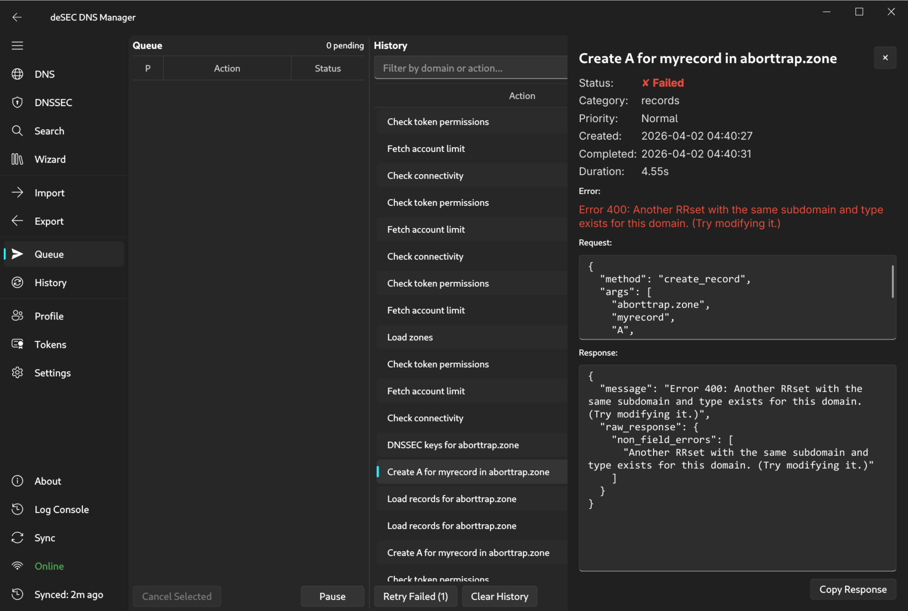

- `QueueDetailPanel` slide-in (480 px) for the selected failed entry
- Header: *"Create CNAME for www in aborttrap.zone"*
- Metadata: Status **✗ Failed** (red), Category: records, Priority: Normal, Created/Completed timestamps, Duration: 4.20 s
- **Error** section in red: *"Error 400: Another RRset with the same subdomain and type exists for this domain."*
- **Request** JSON block and **Response** JSON block with full API payload
- **Copy Response** button; **Retry Failed (1)** and **Clear History** in the toolbar

---

## 10 — Version History

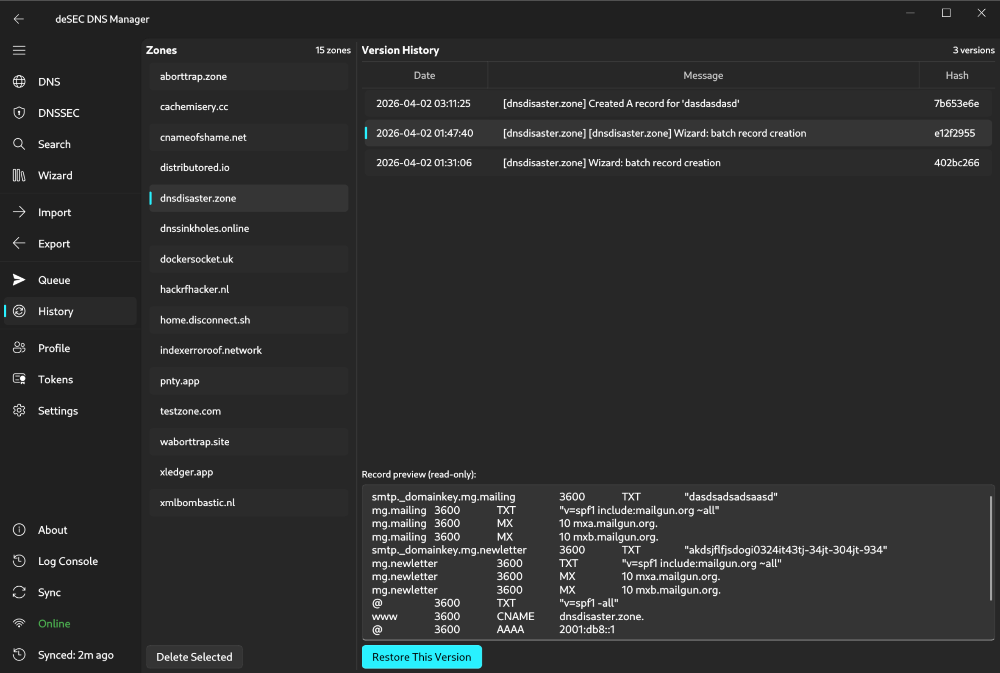

- **History** sidebar page; 6 versioned zones listed on the left; `waborttrap.site` selected
- Timeline on the right: 6 commits with date, descriptive message (e.g. *"Created A record for 'test1'"*, *"Pre-delete snapshot (zone destroyed)"*), and short git hash
- **Record preview** panel at the bottom shows the zone state at the selected commit (name, TTL, type, content columns)
- **Restore This Version** primary button; **Delete Selected** for removing old snapshots

---

## 11 — Token Manager

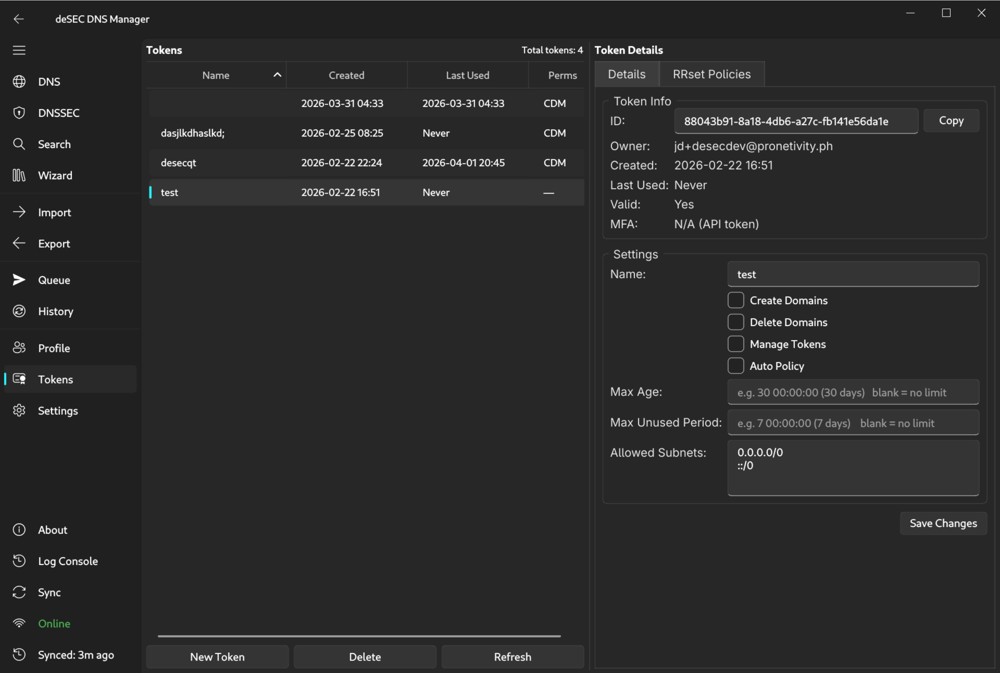

- **Tokens** sidebar page; token list (4 tokens) with columns: Name (sorted A→Z), Created, Last Used, Perms
- `test` token selected; **Token Details** right panel with **Details** and **RRset Policies** tabs
- Details tab — Token Info: ID (with Copy button), Owner, Created, Last Used, Valid, MFA type
- Settings section: Name field, permission checkboxes (Create Domains, Delete Domains, Manage Tokens, Auto Policy), Max Age, Max Unused Period, Allowed Subnets (0.0.0.0/0 + ::/0)
- **Save Changes** button; **New Token**, **Delete**, **Refresh** at the bottom of the token list

---

## 12 — Token Policy Edit Panel

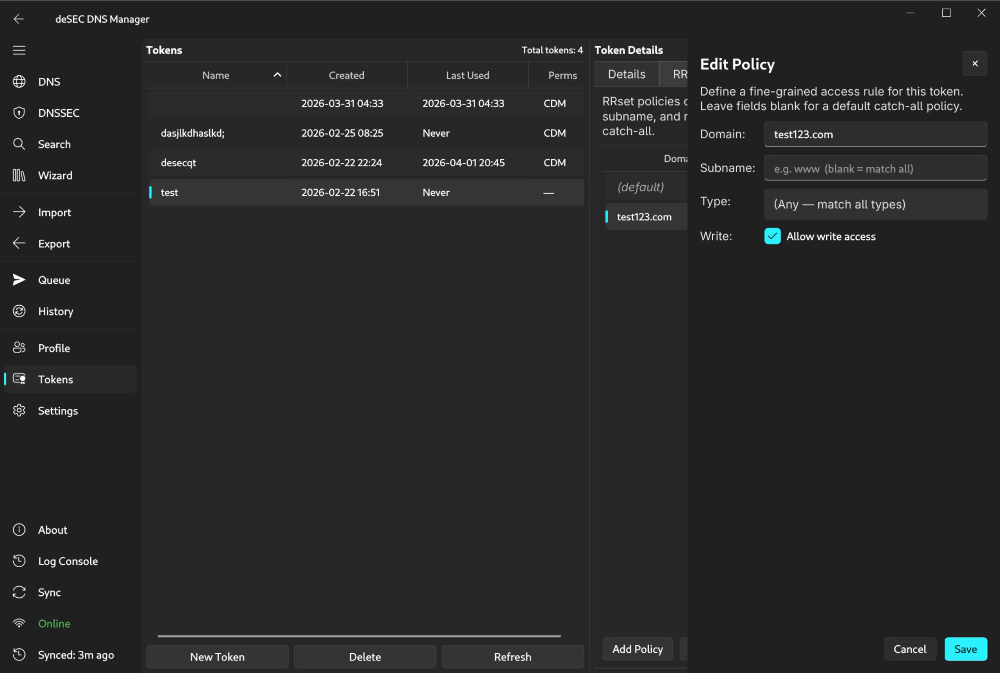

- `TokenPolicyPanel` slide-in (400 px) overlaying the Token Details area
- Title: **Edit Policy**; description text explains blank fields act as catch-all
- Fields: Domain (`test123.com`), Subname (blank = match all), Type (Any — match all types), Write (**Allow write access** checkbox ticked)
- **Add Policy**, **Cancel**, **Save** buttons; underlying Policies tab shows existing entries

---

## 13 — Settings

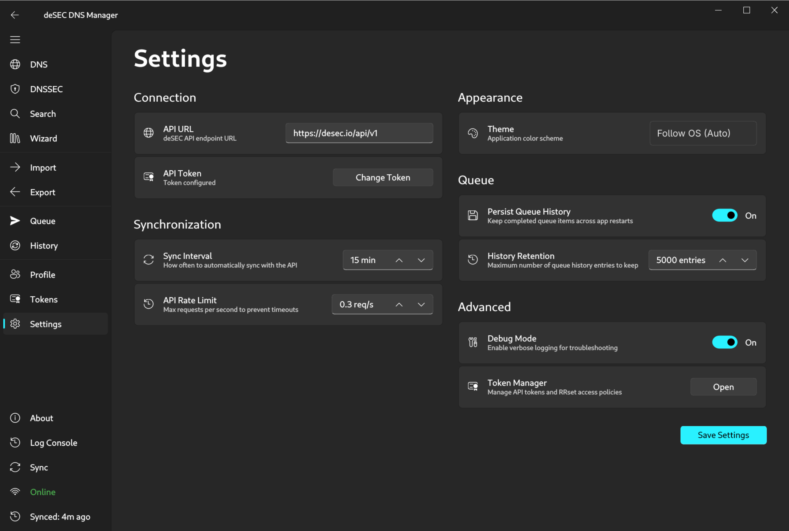

- **Settings** sidebar page; two-column `SettingCardGroup` layout
- Left column — **Connection**: API URL (`https://desec.io/api/v1`), API Token (Change Token button); **Synchronization**: Sync Interval (15 min), API Rate Limit (0.3 req/s)
- Right column — **Appearance**: Theme (Follow OS / Auto); **Queue**: Persist Queue History (On), History Retention (5000 entries); **Advanced**: Debug Mode (On), Token Manager shortcut (Open button)
- **Save Settings** primary button at the bottom right

---

## 14 — Log Console

- **Log Console** sidebar page; 4 messages with timestamps
- Colour coding: default text (info) · green (success) · red (error)
- Messages shown: *Loaded data from cache* (info), *Retrieved 42 zones from API* (green), *Queued: Create CNAME for 'www' in aborttrap.zone* (info), *Failed to save record: Error 400…* (red, wrapped)
- **Clear** button and message count (`4 messages`) in the header

---

## 15 — Collapsed Sidebar

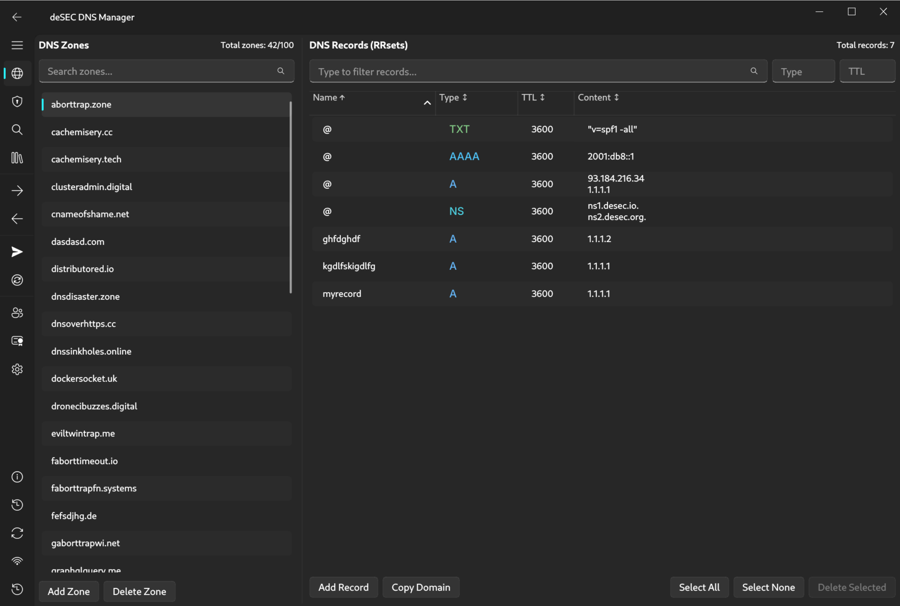

- Same DNS page as screenshot 01 with the sidebar collapsed to icon-only mode (≈ 48 px)
- All sidebar items visible as icons only: globe, shield (DNSSEC), search, arrows (Import/Export), send (Queue), update (History), people, certificate, settings, info, history, sync, wifi
- Provides maximum horizontal space for the two-pane DNS view
- Collapse/expand toggled with the hamburger button at the top-left
