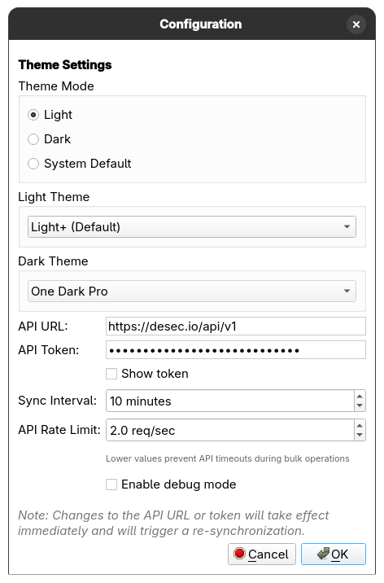

# Screenshots

This directory contains screenshots of the deSEC Qt DNS Manager application showcasing its various features and interfaces.

## Application Screenshots

### Main Interface

**`main_window.png`**
- Primary application interface showing the two-pane layout
- Zone list on the left (with "Total zones: 1/100" account limit display), DNS records table on the right
- Records table with checkbox column for batch selection, Select All / Select None / Delete Selected toolbar
- Log console at the bottom with colour-coded messages
- Status bar showing last sync time and online/offline state

### Configuration

**`settings_window.png`**
- Configuration dialog showing Theme Settings (Light / Dark / System Default) and per-mode theme selection
- API URL, token (masked), sync interval, and API rate limit controls
- Debug mode toggle and note about re-synchronisation on credential change

### Global Search & Replace

**`search_replace_search.png`**
- Global Search & Replace dialog after running a search across all zones
- Search filters: Subname, Content, Type, TTL, Zone, and optional regex mode
- Results table with per-row checkboxes, Select All / Select None, and Export Results
- Replace section showing content find → replace and subname/TTL change fields

**`search_replace_applied.png`**
- Same dialog after applying a content replacement
- Result row highlighted in green; status reads "Replace complete — 1 replaced"
- Change Log section showing old vs. new values for each modified record

### Token Management

**`token_manager.png`**
- API Token Manager with a list of tokens (name, created, last used, valid status, permissions)
- Right panel: Details tab showing token ID, owner, validity, and editable settings (name, permissions, expiration, allowed subnets)
- RRset Policies tab for fine-grained access control
- New Token / Delete / Refresh / Save Changes controls

**`token_create.png`**
- Create New Token dialog with Token Settings group
- Name field and permission checkboxes: perm_create_domain, perm_delete_domain, perm_manage_tokens, auto_policy
- Expiration section: Max Age and Max Unused Period
- Allowed Subnets text area (pre-filled with 0.0.0.0/0 and ::/0)

**`token_policy_add.png`**
- Add Policy dialog for defining fine-grained RRset access rules
- Fields: Domain, Subname, Type (dropdown), and Write permission toggle

**`token_policy_edit.png`**
- Edit Policy dialog with the same fields, pre-filled with existing policy values

### Import/Export

**`export_window.png`**
- Import/Export dialog — Export tab
- Zone selection dropdown, format options (JSON, YAML, BIND, djbdns), metadata toggle
- Output file field with Browse and Auto-Generate buttons, Export Zone action button
- Enable Bulk Export checkbox for multi-zone ZIP export mode

**`import_window.png`**
- Import/Export dialog — Import tab
- File selection, format options, target zone selector with auto-create support
- Existing Records Handling: Append / Merge / Replace modes with descriptions
- Import Preview section and Import Zone action button

### Multi-Profile Support

**`profile_management.png`**
- Profile Management dialog listing available profiles with current profile highlighted
- Profile Information panel: name, display name, created date, last used date
- Controls: Switch To, Create New, Rename, Delete, Refresh

**`profile_create.png`**
- Create New Profile dialog with Profile Name and Display Name fields
- Help text explaining naming constraints

## File Sizes

| Screenshot | Size | Purpose |
|------------|------|---------|
| `main_window.png` | 639 KB | Primary interface showcase |
| `search_replace_applied.png` | 452 KB | Search & Replace after apply, with change log |
| `token_manager.png` | 384 KB | Token Manager overview |
| `search_replace_search.png` | 337 KB | Search & Replace results view |
| `import_window.png` | 362 KB | Import dialog |
| `token_create.png` | 268 KB | Create New Token dialog |
| `settings_window.png` | 216 KB | Configuration dialog |
| `export_window.png` | 204 KB | Export dialog |
| `profile_management.png` | 199 KB | Profile Management dialog |
| `token_policy_add.png` | 141 KB | Add Policy dialog |
| `token_policy_edit.png` | 132 KB | Edit Policy dialog |
| `profile_create.png` | 102 KB | Create New Profile dialog |

**Total**: ~3.3 MB for complete visual documentation of the application.
